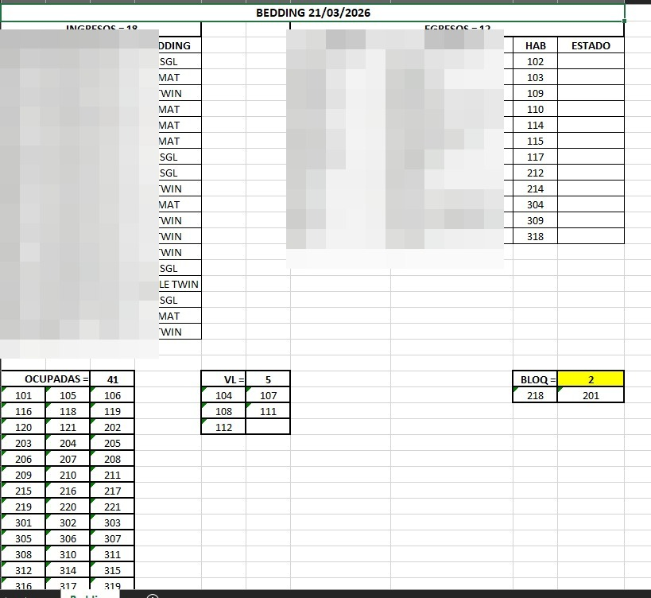

# 🍳🛏️ Hotel Ops Extractor: Cloudbeds → F&B & Housekeeping

A hybrid **JavaScript + Python** tool with a *Human-in-the-loop* approach that eliminates manual data entry and report cleanup in hotel operations. It solves two daily logistical problems: knowing exactly which guests have breakfast included in their reservation, and for the Housekeeping department: interpreting bed setup requirements written as free-text notes.

> **Commercial Impact:** Transforms a tedious manual reconciliation and Excel cleanup process into a guided execution of **3 minutes**.

---

## 🚀 The Problem vs. The Solution

**The Problem:**
The night auditor had to download the *Hosted Guests Report* from Cloudbeds, manually clean and format the Excel (delete unnecessary columns, adjust widths, reformat cells), and then review row by row to determine which guests had breakfast included and which did not. A slow, repetitive process prone to human error, repeated every night.

**The Solution:**
A two-layer system that captures data directly from the Cloudbeds interface while the auditor browses normally, and automatically processes it by splitting the information into two print-ready Excel files: one for Breakfast and one for Bedding.

---

## 🏗️ Hybrid Architecture (JS + Python)

The system has two components that work in sequence:

```
[Cloudbeds Web UI]
       │
       ▼
┌─────────────────────────────┐
│  LAYER 1 — Frontend         │
│  Tampermonkey Script (JS)   │
│  Floating widget injected   │
│  into the browser           │
└────────────┬────────────────┘
             │  Audibot_Data_Cruda.csv
             ▼
┌─────────────────────────────┐
│  LAYER 2 — Backend          │
│  Python Engine              │
│  MAQUETAR_REPORTS.bat       │
└────────────┬────────────────┘
             │
             ▼
    [F&B Excel] and [Bedding Excel]
```

*   **Frontend (Tampermonkey/JS):** Script injected into the browser that creates a floating widget. As the auditor browses reservations in Cloudbeds, the script captures each guest's notes and requirements in the background. When finished, it exports an `Audibot_Data_Cruda.csv` file.


*   **Backend (Python + openpyxl):** Engine that reads the CSV, cross-references the data, applies the business logic (who has breakfast included based on rate type or reservation note) and generates the final formatted report. It also includes an NLP/Regex module that interprets the intent of free-text notes to define bed setup (double, twin, crib), requesting user input via console only in ambiguous cases or blocked rooms.

---

## 📋 Workflow (Step by Step)

The complete process follows four guided steps:

**Step 1 — Data Capture (JS)**
The auditor browses the reservation list in Cloudbeds. The floating widget automatically captures the relevant data from each reservation in the background.

**Step 2 — Export CSV**
With one click on the widget, the script generates and downloads the `Audibot_Data_Cruda.csv` file with all captured information.

**Step 3 — Processing (Python)**
The auditor moves the CSV to the system folder and runs `MAQUETAR_REPORTS.bat`. The Python engine processes the data and displays a real-time summary in the console:

```
Records: 97 | With Breakfast: 58 | Without Breakfast: 39
```

**Step 4 — Final Output**
Two Excel files are automatically generated with conditional formatting, optimized column widths, and print-ready layouts delivered to F&B and Housekeeping at the start of the day.




---

## 📊 Commercial Impact

| | Manual Process | With Automation |
|---|---|---|
| **Time** | 20–30 min of data entry + cleanup | ~3 minutes |
| **Errors** | Prone to row-by-row omissions | Automatic processing |
| **Output** | Unformatted Excel, requires manual layout | Print-ready |
| **Scalability** | Degrades with more guests | Constant regardless of volume |

The system is designed to adapt to any hotel operating on Cloudbeds, regardless of reservation volume or rate structure.

---

## 🛠️ Technologies

*   **Browser automation:** Tampermonkey (JavaScript userscript)
*   **Data processing:** Python 3.12+
*   **Report generation:** openpyxl (conditional formatting, automatic column widths)
*   **Distribution:** `.bat` script for one-click execution on Windows

---

## 📬 Contact

Do you have an operational workflow you want to automate? I can develop a similar solution for your business.

*   **LinkedIn:** [Sebastián González](https://www.linkedin.com/in/sebasti%C3%A1n-gonz%C3%A1lez-571a18195/)
*   **Email:** [sebag2298@gmail.com](mailto:sebag2298@gmail.com)
