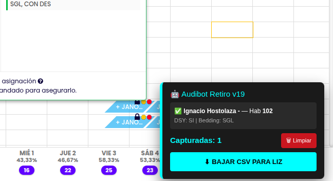
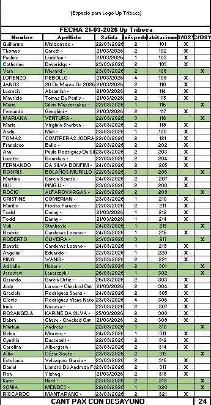

# 🍳 Automatización de Reportes de Desayunos: Cloudbeds → F&B

Una herramienta híbrida **JavaScript + Python** con enfoque *Human-in-the-loop* que elimina el trabajo manual de data entry y limpieza de reportes en hotelería. Resuelve un problema logístico cotidiano del área de Alimentos y Bebidas (F&B): saber exactamente quién tiene el desayuno incluido en su reserva.

> **Impacto Comercial:** Transforma un proceso tedioso de conciliación manual y limpieza de Excel en una ejecución guiada de **3 minutos**.

---

## 🚀 El Problema vs. La Solución

**El Problema:**
El auditor nocturno debía descargar el *Reporte de Huéspedes Hospedados* desde Cloudbeds, limpiar y maquetar el Excel manualmente (borrar columnas innecesarias, ajustar anchos, reformatear celdas), y luego revisar fila por fila para determinar qué huéspedes tenían el desayuno incluido y cuáles no. Un proceso lento, repetitivo y propenso a errores humanos, que debía repetirse cada noche.

**La Solución:**
Un sistema en dos capas que captura los datos directamente desde la interfaz de Cloudbeds mientras el auditor navega con normalidad, y los procesa automáticamente en un Excel listo para imprimir.

---

## 🏗️ Arquitectura Híbrida (JS + Python)

El sistema tiene dos componentes que trabajan en secuencia:

```
[Cloudbeds Web UI]
       │
       ▼
┌─────────────────────────────┐
│  CAPA 1 — Frontend          │
│  Script Tampermonkey (JS)   │
│  Widget flotante inyectado  │
│  en el navegador            │
└────────────┬────────────────┘
             │  Audibot_Data_Cruda.csv
             ▼
┌─────────────────────────────┐
│  CAPA 2 — Backend           │
│  Motor Python               │
│  MAQUETAR_REPORTS.bat       │
└────────────┬────────────────┘
             │
             ▼
    [Excel F&B — listo para imprimir]
```

*   **Frontend (Tampermonkey/JS):** Script inyectado en el navegador que crea un widget flotante. A medida que el auditor navega por las reservas en Cloudbeds, el script captura en segundo plano la información de notas y requerimientos de cada huésped. Al finalizar, exporta un archivo `Audibot_Data_Cruda.csv`.



*   **Backend (Python + openpyxl):** Motor que lee el CSV, cruza los datos, aplica la lógica de negocio (quién tiene desayuno incluido según el tipo de tarifa o nota de reserva) y genera el reporte final formateado.

---

## 📋 Flujo de Trabajo (Paso a Paso)

El proceso completo sigue cuatro pasos guiados:

**Paso 1 — Captura de datos (JS)**
El auditor navega por el listado de reservas en Cloudbeds. El widget flotante del script captura automáticamente los datos relevantes de cada reserva en segundo plano.

**Paso 2 — Exportar CSV**
Con un clic en el widget, el script genera y descarga el archivo `Audibot_Data_Cruda.csv` con toda la información capturada.

**Paso 3 — Procesamiento (Python)**
El auditor mueve el CSV a la carpeta del sistema y ejecuta `MAQUETAR_REPORTS.bat`. El motor Python procesa los datos y muestra un resumen en tiempo real en la consola:

```
Registros: 97 | Con Desayuno: 58 | Sin Desayuno: 39
```

**Paso 4 — Output Final**
Se genera automáticamente un Excel con formato condicional, anchos de columna optimizados y diseño listo para imprimir, que se entrega al área de F&B al inicio del día.



---

## 📊 Impacto Comercial

| | Proceso Manual | Con Automatización |
|---|---|---|
| **Tiempo** | 20-30 min de data entry + limpieza | ~3 minutos |
| **Errores** | Propenso a omisiones fila por fila | Procesamiento automático |
| **Output** | Excel sin formato, requiere maquetar | Listo para imprimir |
| **Escalabilidad** | Se degrada con más huéspedes | Constante sin importar el volumen |

El sistema está diseñado para adaptarse a cualquier hotel que opere con Cloudbeds, independientemente del volumen de reservas o la estructura de tarifas.

---

## 🛠️ Tecnologías

*   **Automatización del navegador:** Tampermonkey (userscript JavaScript)
*   **Procesamiento de datos:** Python 3.12+
*   **Generación de reportes:** openpyxl (formato condicional, anchos automáticos)
*   **Distribución:** Script `.bat` para ejecución con un clic en Windows

---

## 📬 Contacto

¿Tenés un flujo operativo que querés automatizar? Puedo desarrollar una solución similar para tu negocio.

*   **LinkedIn:** [Sebastián González](https://www.linkedin.com/in/sebasti%C3%A1n-gonz%C3%A1lez-571a18195/)
*   **Email:** [sebag2298@gmail.com](mailto:sebag2298@gmail.com)
